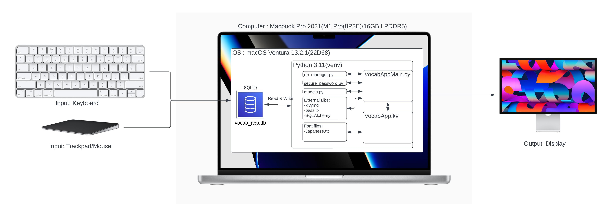
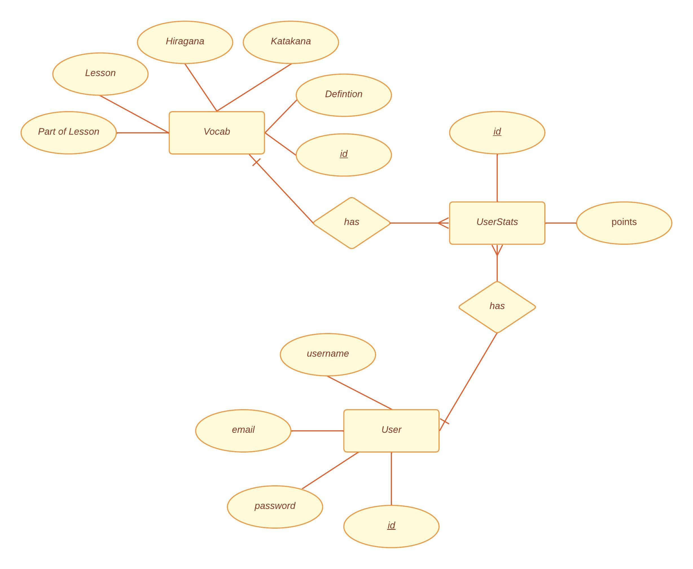

[^1]

[^1]: 日本語を勉強する外国人のイラスト, いらすとや

# Unit 3 Project: Japanese Vocab Revision App

## Criteria A: Planning

## Problem definition(Client identification)

Alessandro is a student studying Japanese ab initio in UWC ISAK Japan. He is finding it hard to revise the vocabulary for the weekly vocabulary test as most of the voabulary in the book is very spread out and hard to find. Not to mention vocabs in the textbook don't usuallu come with English meanings, which increases the hassle. As he wants a systematic way of revising for the vocabulary tests, he wants an application on his computer to assist him when he revises Japanese vocabulary while also keeping track of his progress. In addition, as the application may be used by multiple people but Alessandro wants to keep the progress tracking specific to the person, so the application requires a login system as well.

## Proposed Solution

Considering the client's requirements, an adequate solution would include a localized computer program with a GUI(Graphical User Interface) that can store data into a database. Python would be an adequate programming language for the solution as it is open source, it is mature and supported in mutiple platforms (platform-independent) including macOS, Windows, Linux.[^2]For the database, SQLite would be an adequate solution as it is a embedded, serverless relational database which means the program and the database can be both localized.[^3]To interface with the SQLite database, SQLAlchemy is the choice to go as it support ORM(Object Relational Mapper). An ORM is a database abstraction layer that sits as an intermediary between the code and the database engine[^4], which simplies queries and makes the code more concise. As for the GUI, KivyMD is chosen for its elegant and simpleness. This GUI framework uses is structured in object-oriented format and makes the development easy[^5]

[^2]: Python Geeks. “Advantages of Python: Disadvantages of Python.” Python Geeks, 26 June 2021, https://pythongeeks.org/advantages-disadvantages-of-python/.
[^3]: S, Ravikiran A. “What Is Sqlite? and When to Use It?” *Simplilearn.com*, Simplilearn, 16 Feb. 2023, https://www.simplilearn.com/tutorials/sql-tutorial/what-is-sqlite.
[^4]:  Uwase, Ange. “Here Is the Reason Why SQLAlchemy Is so Popular.” Medium, 8 Feb. 2021,https://towardsdatascience.com/here-is-the-reason-why-sqlalchemy-is-so-popular-43b489d3fb00#:~:text=SQLAlchemy%20is%20the%20ORM%20of.
[^5]: Gupta, Kaustubh. “What Is KivyMD: Creating Android Machine Learning Apps Using KivyMD.” *Analytics Vidhya*, 6 July 2021, https://www.analyticsvidhya.com/blog/2021/06/creating-android-ml-app-kivymd/#:~:text=KivyMD%20is%20built%20on%20the.

**Design statement**  

I will design a Python application running on the KivyMD GUI framework which stores data in a SQLite database for Alessandro. This application let Alessandro manually input vocabulary into the database, review vocabulary from a card-style interface and keep track of his progress. Everything is secured under a hashed login system to keep users progress seperately. It will take approximately 1 month to complete and will be evaluated according to criteria below:

## Success Criteria

1. User progress will be kept independently using a encrypted login system
2. The program will allow input of vocabulary manually
3. A point system would be implemented to keep track of a user's progress
4. The program will be built using a Material Design framework and employ a unfied color theme
5. User should be able to choose from specific sets of vocabulary or a randomized set
6. The vocabulary should be shown with the English meaning and tapped to reveal the Hiragana and Katakana

# Criteria B: Design

## System Diagram

**Fig.1** *System diagram of the Japanese Vocab Revision App*

## Data Storage

**Fig.2** *ER diagram of the Japanese Vocab Revision App Database*

## Wireframe

## Record of Tasks

| Task No | Planned Action                                   | Planned Outcome                                              | Time estimate | Target completion date | Criterion |
| ------- | ------------------------------------------------ | ------------------------------------------------------------ | ------------- | ---------------------- | --------- |
| 1       | Planning: First Meeting with client              | Start collecting the context of the problem                  | 6min          | Feb 7                  | A         |
| 2       | Planning: Defining problem and proposed solution | Start on refining client's requirements and tools needed     | 2hr           | Feb 15                 | A         |
| 3       | Coding: Initializing codebase                    | To have the base environment of program ready for coding     | 1hr           | Feb 20                 | B         |
| 4       | Planning : Second Meeting with client            | Decided success criteria                                     | 5min          | Feb 21                 | A         |
| 5       | Coding: Coding the main part of the program      | Finish coding the program                                    | 5hr           | Mar 1                  | C         |
| 6       | Creating System Diagrams                         | To have system diagram for application and database finished | 40min         | Mar 2                  | B         |
|         |                                                  |                                                              |               |                        |           |

## Flow Diagrams

### MVP Program

*Fig.2* **Flow diagram for the MVP program.**

### Main Program

*Fig.3 **Flow diagram for the main program.**

## Test Plan

| Type    | Input | Process | Anticipated Outcome |
| ------- | ----- | ------- | ------------------- |
| *Insert |       |         |                     |
|         |       |         |                     |

# Criteria C: Development

## Existing Tools

| Software/Development Tools | Coding Structure Tools       | Libraries  |
| -------------------------- | ---------------------------- | ---------- |
| PyCharm                    | OOP Structures(Classes)      | Kivymd.app |
| Python                     | SQL requests                 | Passlib    |
| SQLite                     | Databases                    | sqlalchemy |
| KivyMD                     | Encryption                   |            |
| Github Copilot             | For Loops                    |            |
| ChatGPT                    | If-then-else statements      |            |
|                            | ORM(Object Relation Mapping) |            |

## List of techniques used

1. 

## Computational Thinking

#### Decomposition

In computational thinking, decomposition refers to breaking a complex problem or system into parts that are easier to conceive, understand, program, and maintain.

#### Pattern recognition, generalization and abstraction

#### Algorithms

## Development

#### OOP

#### MVP - Minimum Viable Product

In order to validate our concept of creation, we created a MVP as a prototype to make sure our concept is reliable and
achievable. 

# Criteria D: Functionality

## Demonstration Video

*To be done

# Appendix

