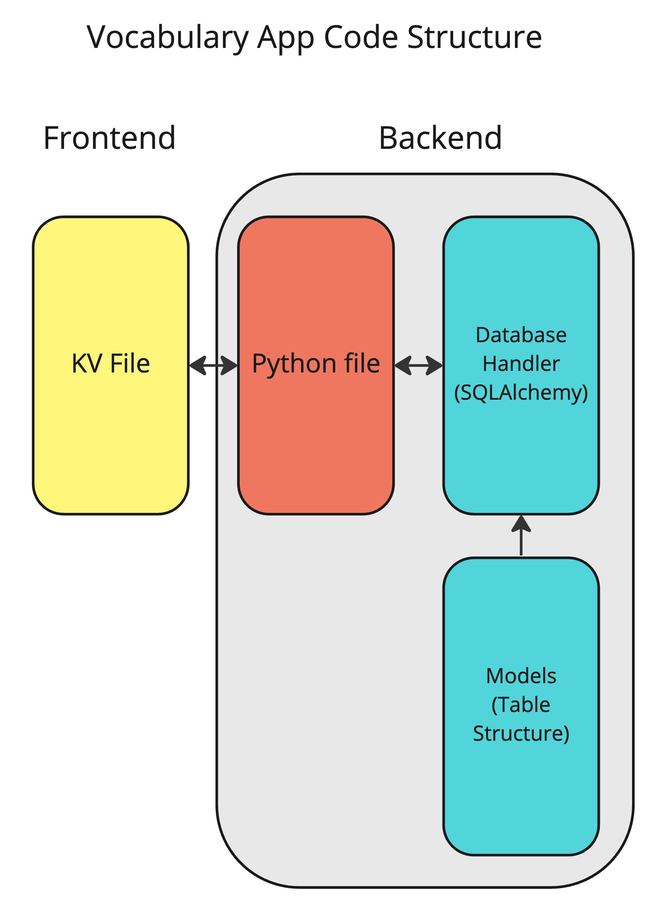

[^1]

[^1]: 日本語を勉強する外国人のイラスト, いらすとや

# Unit 3 Project: Japanese Vocab Revision App

## Criteria A: Planning

## Problem definition(Client identification)

Alessandro is a student studying Japanese ab initio in UWC ISAK Japan. He is finding it hard to revise the vocabulary for the weekly vocabulary test as most of the voabulary in the book is very spread out and hard to find. Not to mention vocabs in the textbook don't usuallu come with English meanings, which increases the hassle. As he wants a systematic way of revising for the vocabulary tests, he wants an application on his computer to assist him when he revises Japanese vocabulary while also keeping track of his progress. In addition, as the application may be used by multiple people but Alessandro wants to keep the progress tracking specific to the person, so the application requires a login system as well.

## Proposed Solution

Considering the client's requirements, an adequate solution would include a localized computer program with a GUI(Graphical User Interface) that can store data into a database. Python would be an adequate programming language for the solution as it is open source, it is mature and supported in mutiple platforms (platform-independent) including macOS, Windows, Linux.[^2]For the database, SQLite would be an adequate solution as it is a embedded, serverless relational database which means the program and the database can be both localized.[^3]To interface with the SQLite database, SQLAlchemy is the choice to go as it support ORM(Object Relational Mapper). An ORM is a database abstraction layer that sits as an intermediary between the code and the database engine[^4], which simplies queries and makes the code more concise. As for the GUI, KivyMD is chosen for its elegant and simpleness. This GUI framework uses is structured in object-oriented format and makes the development easy[^5]

[^2]: Python Geeks. “Advantages of Python: Disadvantages of Python.” Python Geeks, 26 June 2021, https://pythongeeks.org/advantages-disadvantages-of-python/.
[^3]: S, Ravikiran A. “What Is Sqlite? and When to Use It?” *Simplilearn.com*, Simplilearn, 16 Feb. 2023, https://www.simplilearn.com/tutorials/sql-tutorial/what-is-sqlite.
[^4]:  Uwase, Ange. “Here Is the Reason Why SQLAlchemy Is so Popular.” Medium, 8 Feb. 2021,https://towardsdatascience.com/here-is-the-reason-why-sqlalchemy-is-so-popular-43b489d3fb00#:~:text=SQLAlchemy%20is%20the%20ORM%20of.
[^5]: Gupta, Kaustubh. “What Is KivyMD: Creating Android Machine Learning Apps Using KivyMD.” *Analytics Vidhya*, 6 July 2021, https://www.analyticsvidhya.com/blog/2021/06/creating-android-ml-app-kivymd/#:~:text=KivyMD%20is%20built%20on%20the.

**Design statement**  

I will design a Python application running on the KivyMD GUI framework which stores data in a SQLite database for Alessandro. This application let Alessandro manually input vocabulary into the database, review vocabulary from a card-style interface and keep track of his progress. Everything is secured under a hashed login system to keep users progress seperately. It will take approximately 1 month to complete and will be evaluated according to criteria below:

## Success Criteria

1. User progress will be kept independently using a encrypted login system
2. The program will allow input of vocabulary manually
3. A point system would be implemented to keep track of a user's progress
4. The program will be built using a Material Design framework and employ a unfied color theme
5. User should be able to choose from specific sets of vocabulary or a randomized set
6. The vocabulary should be shown with the English meaning and tapped to reveal the Hiragana and Katakana

# Criteria B: Design

## System Diagram


**Fig.1** *System diagram of the Japanese Vocab Revision App*

## Data Storage


**Fig.2** *ER diagram of the Japanese Vocab Revision App Database*. This diagram depicts the database structure used to store the data for this application and how the relationships between table link up the database.

## UML Diagram


**Fig.3** *UML Diagram of the Japanese Vocab Revision App*. This diagram depicts the classes of the application.

## Wireframe


**Fig.4**  *Wireframe of the Japanese Vocab Revision App*

## Record of Tasks

| Task No | Planned Action                                   | Planned Outcome                                              | Time estimate | Target completion date | Criterion |
| ------- | ------------------------------------------------ | ------------------------------------------------------------ | ------------- | ---------------------- | --------- |
| 1       | Planning: First Meeting with client              | Start collecting the context of the problem                  | 6min          | Feb 7                  | A         |
| 2       | Planning: Defining problem and proposed solution | Start on refining client's requirements and tools needed     | 2hr           | Feb 15                 | A         |
| 3       | Coding: Initializing codebase                    | To have the base environment of program ready for coding     | 1hr           | Feb 20                 | B         |
| 4       | Planning : Second Meeting with client            | Decided success criteria                                     | 5min          | Feb 21                 | A         |
| 5       | Coding: Coding the main part of the program      | Finish coding the program                                    | 5hr           | Mar 1                  | C         |
| 6       | Creating System Diagrams                         | To have system diagram for application and database finished | 40min         | Mar 2                  | B         |
| 7       | Coding: Beautifying Graphical User Interface     | To make the interface more user-friendly and easily understandable | 2hr           | Mar 3                  | C         |
|         |                                                  |                                                              |               |                        |           |

## Flow Diagrams

#### Password Authentication


**Fig.5**  *Flow diagram of Password Authentication system*

#### Vocab Cards & Point System


**Fig.6** *Flow diagram of Point System*

#### Vocab Entry Editing


**Fig.7**  *Flow diagram of Vocab Editing function*

## Test Plan

| Type    | Input | Process | Anticipated Outcome |
| ------- | ----- | ------- | ------------------- |
| *Insert |       |         |                     |
|         |       |         |                     |

# Criteria C: Development

## Existing Tools

| Software/Development Tools | Coding Structure Tools       | Libraries  |
| -------------------------- | ---------------------------- | ---------- |
| PyCharm                    | OOP Structures(Classes)      | Kivymd.app |
| Python                     | SQL requests                 | Passlib    |
| SQLite                     | Databases                    | sqlalchemy |
| KivyMD                     | Encryption                   |            |
| Github Copilot             | For Loops                    |            |
| ChatGPT                    | If-then-else statements      |            |
|                            | ORM(Object Relation Mapping) |            |

## List of techniques used

1. Object Oriented Programming(OOP)
1. Object Relation Mapping(ORM):SQLAlchemy
1. KivyMD Library
1. For loops
1. if statements
1. Password Hashing
1. Interacting with Databases
1. Arrays and Lists
1. Text Formatting

## Computational Thinking

#### Decomposition

In computational thinking, decomposition refers to breaking a complex problem or system into parts that are easier to conceive, understand, program, and maintain. In this project, one key thing was  the point system to store statistics and the user's performance in the database. As this require multiple steps, I broke down the whole action in the into collecting user and vocabulary information, calling back to another function inside the database handler and shifting to the next card in the GUI. Here's a snippet of the the function for adding points.

##### Main Function

```python
def add_points(self):
      global count
      global current_user
      try:
        #Collecting user infomation and id of the vocabulary
          user_id = current_user.id
          id = vocab_list[count][3]
         #Calling back to the database handler to update the entry
          VocabApp.db.update_user_stats(user_id, id, 1)
          #Log the action
          Logger.info("Points removed successfully")
          #Shifting to the next vocabulary
          count += 1
          self.next_vocab()
      except Exception as e:
        #Error Catching
          Logger.error(f"Error removing points: {e}")
```

##### Database Handler

```python
def update_user_stats(self, user_id, vocab_id, point_change):
  	#Queries database for entry specific to the user and the vocabulary
    user_stats = self.session.query(UserStats).filter_by(user_id=user_id, vocabulary_id=vocab_id).first()
    if user_stats is None:
      	#If none is found, a new entry is created automatically with base points of 100
        new_user_stats = UserStats(user_id=user_id, vocabulary_id=vocab_id, points=100)
        #Calculate new points according to the input into the function
        new_user_stats.points += point_change
        #Commit changes to the database
        self.session.add(new_user_stats)
        self.session.commit()
    else:
      	#If existing entry is found, new points are calculated and committed to the database
        user_stats.points += point_change
        self.session.commit()
    return None
```

#### Pattern recognition, generalization and abstraction

After a user hits the back button on a screen, the text fields on the previous screen still stays in the text fields. So the next time when the user opens that specific screen again, they would see that inputs from last time still there. To fix this problem, I implemented a function to clear out all text fields on one screen automatically. Here's the code:

```python
def clear_fields(self):
    self.ids.selected_lesson.text = ""
    self.ids.selected_part.text = ""
    self.ids.selected_hiragana.text = ""
    self.ids.selected_katakana.text = ""
    self.ids.selected_english.text = ""
    self.ids.selected_save.text = "Save"
    self.ids.selected_save.on_press = self.add_vocab
```

As you can see this code is very repetitive. Thus I decided to use a for loop over a list to interate over each text field until they're all empty.

```python
  def clear_fields(self):
        fields_to_clear = ['selected_lesson', 'selected_part', 'selected_hiragana', 'selected_katakana',
                           'selected_english']
        for field in fields_to_clear:
            self.ids[field].text = ""
        self.ids.selected_save.text = "Save"
        self.ids.selected_save.on_press = self.add_vocab
```

In the code above, instead of manually setting each field to an empty string, I'm using a loop to iterate through a list of field names and set each one to an empty string. This would make the code more concise and easier to modify if you ever need to add or remove fields.

#### Algorithms

An algorithm is a step-by-step procedure for solving a problem or performing a task. One action requiring constant usage is the function for inserting vocabulary into the database. The function takes in several inputs (lesson, part, hiragana, katakana, and definition) and performs a series of steps to insert a new vocabulary into the database. The steps include checking if the vocabulary already exists in the database, creating a new Vocabulary object, adding it to the database session, and committing the changes. Here's a snippet of the code:

```python
  def insert_vocab(self, lesson, part, hiragana, katakana, definition):
    #Queries database for if the vocabulary exisit rather than first(), saves on time when table has multiple records
      exists = self.session.query(Vocabulary).filter_by(hiragana=hiragana).exists()
      #Checks if vocabulary exists already
      if exists:
          print("Vocab already exists")
          return False
      else:
        #Create a new vocabulary object
          new_vocab = Vocabulary(lesson=lesson, part_of_lesson=part, hiragana=hiragana, katakana=katakana,
                                 definition=definition)
          self.session.add(new_vocab)
          #Commiting changes
          self.session.commit()
          print("Vocab added")
          return None
```


## Development

### Object Oriented Programming

Object Oriented Programming(OOP), is a programming paradigm that focuses on creating objects that can contain both data and behavior. In OOP, objects are instances of classes, which define the properties and methods that the objects will have. The main advantages of OOP include Modularity, Reusability, Encapsulation, Abstraction and Polymorphism. The whole vocabulary app is constructed using OOP to make it more simple to debug and for future developers to add/change features. Here's a snippet of how OOP was used to organize the code:

```python
class PerVocabManageScreen(MDScreen):
    def __init__(self, **kwargs):
      #Code omitted for demonstrative reasons
    def on_pre_enter(self, *args):
      #Code omitted for demonstrative reasons
    def add_vocab(self):
			#Code omitted for demonstrative reasons
    def clear_fields(self):
			#Code omitted for demonstrative reasons
    def save_changes(self):
       #Code omitted for demonstrative reasons 
```

As seen above, each screen has its own class and each specific action is housed under a function so everything is very clear and easy-to-understand.

### ORM

Object Relation Mapping(ORM), is a programming technique that allows developers to interact with a relational database using an object-oriented programming paradigm. In traditional programming with relational databases, developers use SQL statements to interact with the database. This involves writing SQL code to retrieve, update or delete records in the database. However, with ORM, developers can interact with the database using an object-oriented approach, which is more intuitive and easier to work with. ORM frameworks provide a layer of abstraction between the application and the database. They map database tables to classes in the application, and map columns to properties of those classes. This allows developers to work with objects in their code, rather than having to write SQL code to interact with the database. Here's a snippet of code to show the difference with and without ORM:

```sql
SELECT * FROM users WHERE username = "Bernard"
```

This is a normal SQL statement that can be executed in python throught running a query with the sqlite3 library. This is a language with a low level of abstration.

```python
db.session.query(Users).filter_by(username="Bernard").first()
```

This is the same query done through ORM and a library called SQLAlchemy. SQLAlchemy is a popular open-source ORM framework for Python that provides a set of tools for working with relational databases using Python code. It was first released in 2006 and has since become a widely used tool in the Python community for interacting with databases. SQLAlchemy provides a high-level API for working with databases, allowing developers to interact with databases using Python classes and objects rather than SQL statements. Here's an example of how tables are created in SQLAlchemy with ORM:

```python
class Vocabulary(Base):
    __tablename__ = 'vocabulary'
    id = Column(Integer, primary_key=True)
    lesson = Column(Integer, nullable=False)
    part_of_lesson = Column(Integer, nullable=False)
    katakana = Column(String, nullable=False)
    hiragana = Column(String, nullable=False)
    definition = Column(String, nullable=False)
    stats = relationship("UserStats", back_populates="vocabulary", order_by="UserStats.id")
```

### Code Organisation

When dealing with a complex program, especially ones with a graphical user interfaces, it is a good practice to sepearate the front-end and back-end development. That can make finding code easier and let you be able to group frequently used functions together instead of writing repetitive code over and over which can make debugging a lot harder. In my program, I chose to seperate my code into four parts : the KV file, the python program that interacts with the UI elements, a database handler and a models file to define the table structures.



**Fig.8**  *Diagram showing how code is organised in the app*

As seen above, my code is separated into four parts. That makes debugging and changing features in the future easier and more straightforward.

### Inserting Data

Throughout the development process of the app, uncountable times of testing was done to make sure that the code functions as per my client's request and one of the main areas I tested was the database access. I had to constantly insert data into the database and try to interact with them inside the GUI. As the inserting of the same data was very time consuming and repetitive, I decided to write a small program in python which inserts dummy data into the database for testing. Here's the code:

```python
# create an engine and session
engine = create_engine('sqlite:///vocab_app.db', echo=True)
Session = sessionmaker(bind=engine)
session = Session()
# create some dummy data for the Vocabulary table
dummy_data = [
    {'lesson': 1, 'part_of_lesson': 1, 'katakana': 'ア', 'hiragana': 'あ', 'definition': 'a'},
    {'lesson': 1, 'part_of_lesson': 2, 'katakana': 'イ', 'hiragana': 'い', 'definition': 'i'},
    {'lesson': 1, 'part_of_lesson': 3, 'katakana': 'ウ', 'hiragana': 'う', 'definition': 'u'},
    {'lesson': 1, 'part_of_lesson': 4, 'katakana': 'エ', 'hiragana': 'え', 'definition': 'e'},
    {'lesson': 1, 'part_of_lesson': 5, 'katakana': 'オ', 'hiragana': 'お', 'definition': 'o'},
]
# insert the dummy data into the Vocabulary table
for data in dummy_data:
    vocab = Vocabulary(**data)
    session.add(vocab)
# commit the changes to the database
session.commit()

```

### Point System

One key feature that my client requested was a system to keep track of learning progress of the user. After weighing multiple scoring/statistics systems, I decided to use a system where 100 is the base score per user per vocabulary and points are added/deducted based on the user's feedback on the Vocabulary Cards. To store this data, I created a table that has relations with the `users` table and the `vocabulary` table to make referencing easier and functions in the `database_handler` to change the score accordingly.

#### Table Structure

```python
class UserStats(Base):
    __tablename__ = 'user_stats'
    id = Column(Integer, primary_key=True)
    user_id = Column(Integer, ForeignKey('users.id'))
    vocabulary_id = Column(Integer, ForeignKey('vocabulary.id'))
    points = Column(Integer, nullable=False, default=100)
    # One-to-many relationship with users
    user = relationship("Users", back_populates="user_stats")
    # One-to-many relationship with vocabulary
    Users.user_stats = relationship("UserStats", order_by=id, back_populates="user")
    # Many-to-one relationship with Vocabulary
    vocabulary = relationship("Vocabulary", back_populates="stats")
```

#### Database Handler

```python
def update_user_stats(self, user_id, vocab_id, point_change):
  user_stats = self.session.query(UserStats).filter_by(user_id=user_id, vocabulary_id=vocab_id).first()
  print(f"User stats: {user_stats}")
  if user_stats is None:
      #Creates base statistics for entries that don't exists
      new_user_stats = UserStats(user_id=user_id, vocabulary_id=vocab_id, points=100)
      new_user_stats.points += point_change
      self.session.add(new_user_stats)
      self.session.commit()
  else:
    	#Updates entry
      user_stats.points += point_change
      self.session.commit()
  return None
```

### Randomized Vocabulary Mode

Also according to my client's request is the ability for the application to choose the vocabulary that the user's is relatively weaker at for more revision. To acheive this, I built a function in `database_handler` to retrieve the user's statistics and order the vocabulary with the lowest points to show first.

```python
def get_vocab_by_user_stats(self, user_id):
    # get all vocabs from user stats where user_id = user_id sort by points ascending
    vocab = self.session.query(Vocabulary).join(UserStats).filter(UserStats.user_id == user_id).order_by(
        UserStats.points).all()
    return vocab
```


### MDTextField / JapaneseTextField

```kv
<JapaneseTextField@MDTextField>:
    font_name: 'Japanese.ttc'
    input_type: 'text'

JapaneseTextField:
            id: selected_hiragana
            size_hint: .8,1
            pos_hint: {"center_x":.5}
            hint_text:"Hiragana"
            helper_text: "Enter Hiragana of vocab"
            helper_text_mode: "on_error"
```

Throughout the whole program, an essential element of the graphical user interface was to allow my client to input text into the program. This is an example of the text fields used to input Japanese into the app. Because KivyMD does not support Japanese characters, I had to use a specific font for the text field. As this would cause very repetitve code having to redefine the font file. I created a specific object  ```<JapaneseTextField@MDTextField>``` that lets me define the font for the text field only once.

### MDDialog

```.kv
successdialog = MDDialog(
                title="Success",
                text="User registered successfully",
                size_hint=(0.8, 0.3),
                buttons=[
                    MDFlatButton(
                        text="OK",
                        on_release=lambda x: successdialog.dismiss()
                    )
                ]
            )
            successdialog.open()
```

This is an example of ```MDDialog``` used in my code to indicate to the user that an internal action was completed, becauase otherwise the program would be not intuitive as the user would have no way to tell if an action is completed properly. With the ```MDDialog``` implemented, the user is able get real-time feedback on if the program is performing an action under the hood.

### Text Formatting in MDDataTable

```python
for row in rows:
    temp_hiragana = f"[font=Japanese.ttc]{row.hiragana}[/font]"
    temp_katakana = f"[font=Japanese.ttc]{row.katakana}[/font]"
    row = [str(row.id), str(row.lesson), str(row.part_of_lesson), temp_hiragana, temp_katakana,
           row.definition]
    if row not in self.data_table.row_data:
        self.data_table.row_data.append(row)
```

Above is the code to process the Japanese characters from the database before they get shown on the ```MDDataTable```. This is becuause if a font that aupports Japanese characters is applied, it wouldn't include the Kivy-specific icons and assets(e.g: checkboxes and page-turning buttons) needed to render the table. However, the Kivy-specfic font that includes all the icons and assets required by Kivy would not support Japanese characters. Thus, I decided to format the Japanese text with specific headers and footers to tell Kivy to render the specific Japanese characters with that font.

### Data Validation for email addresses

To make sure the email addresses are actually usable and contactable, I decided to validate the email addresses format before inserting them into the database. To implement this policy, I decided to use the `re` library in python to validate if the user inputted a valid email address. I first defined the pattern which for an email, is `r"[^@]+@[^@]+\.[^@]+"`, I then used the `re.match()` function to check if the inputted text matches the previously defined format. If the pre-defined format is not matched, it would show an error and prompt the user to type in their email address again.  Here's the code:

```python
# Regular expression pattern for email validation
email_pattern = r"[^@]+@[^@]+\.[^@]+"

# Validate the email format
if not re.match(email_pattern, email):
    # Show an error message
    self.ids.email.error = True
    self.ids.email.helper_text = "Invalid email format"
    self.ids.email.helper_text_mode = "on_error"
```


### MDFillRoundFlatIconButton

`MDFillRoundFlatIconButton` is one of the many buttons styles available in Kivy. I started out using `MDRaisedButton`  for everything, but the further into the coding process, I realized that there are a lot more button styles that can make my application more intuitive. I'm using this type of button in my login screen.

```kv
MDFillRoundFlatIconButton:
    id: login_button
    text: "Login"
    icon: "login"
    pos_hint: {"center_x": 0.5}
    on_release: root.login()
    md_bg_color: app.theme_cls.primary_color
    size_hint_x: 0.8
    disabled: not uname.text or not pwd.text
    disabled_color: app.theme_cls.disabled_hint_text_color
    elevation_normal: 12 if uname.text and pwd.text else 0
    _md_bg_color_disabled: app.theme_cls.disabled_hint_text_color
    _md_bg_color_active: app.theme_cls.primary_light
```

As seen in the code above, the button is disabled if the `uname` or `pwd` input fields are empty, and its background color is set to the application's theme color for disabled text. When clicked, it calls the `login()` method of the widget's root object. The button has a shadow of 12 pixels when the `uname` and `pwd` input fields have text, and its background color changes to a lighter shade of the primary color defined in the application's theme when pressed.

### MDFloatingActionButton

`MDFloatingActionButton` is one of the other many button styles in KivyMD. This type of button include an icon as its main focus. It can replace text with icons that represent self-explanitory functions, not to mention they are more intuitive and less graphic heavy on the GUI. Thus, I chose to use this button on the Home Screen of the application. Here's a snippet of code showing the logout button:

```kv
MDFloatingActionButton:
  id: logout
  icon: "logout"
  text: "Logout"
  halign:"right"
  md_bg_color: app.theme_cls.accent_color
  text_color: app.theme_cls.text_color
  pos_hint: {"center_x": .5, "center_y": .5}
  on_press:
      root.logout()
```

### Color Theme

As per my client's request, he requires a unified color theme to the whole application. To acheive this, instead of manually keeping track of which UI element uses which color, I defined a color scheme on the top of my Kivy file and just call back to this color theme everytime I need to refer to the colors.

```kv
# Define custom color scheme
<CustomTheme>:
    primary_palette: "Blue"
    accent_palette: "Green"
    theme_style: "Light"
    primary_hue: "500"
```

# Criteria D: Functionality


## Demonstration Video

*To be done

# Appendix

### First meeting with client


**Fig.?** *Rough notes from first meeting with client, includes basic ideas behind client's app*

### Success Criteria Meeting(Second Meeting)


**Fig.?** *Rough notes from second meeting with client, includes details of success criteria*


