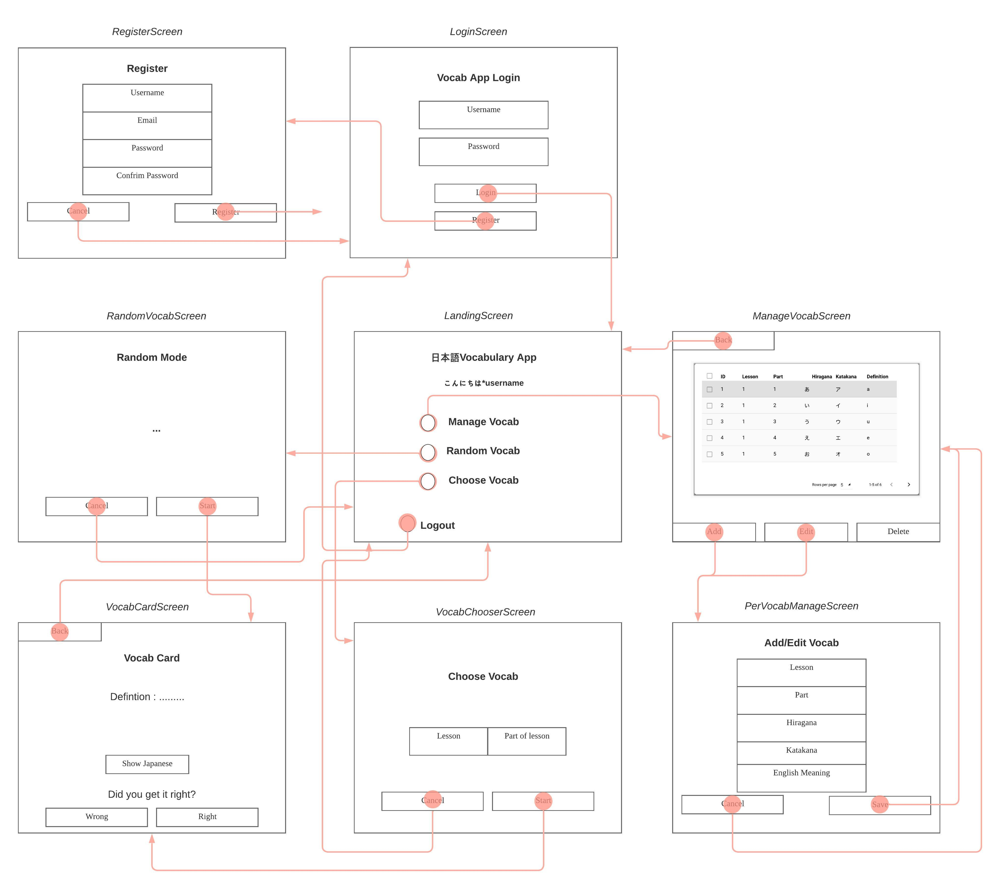
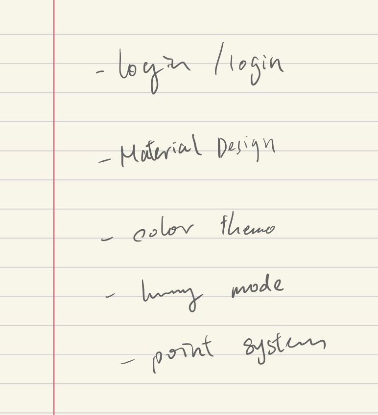

[^1]

[^1]: 日本語を勉強する外国人のイラスト, いらすとや

# Unit 3 Project: Japanese Vocab Revision App

## Criteria A: Planning

## Problem definition(Client identification)

Alessandro is a student studying Japanese ab initio in UWC ISAK Japan. He is finding it hard to revise the vocabulary for the weekly vocabulary test as most of the voabulary in the book is very spread out and hard to find. Not to mention vocabs in the textbook don't usuallu come with English meanings, which increases the hassle. As he wants a systematic way of revising for the vocabulary tests, he wants an application on his computer to assist him when he revises Japanese vocabulary while also keeping track of his progress. In addition, as the application may be used by multiple people but Alessandro wants to keep the progress tracking specific to the person, so the application requires a login system as well.

## Proposed Solution

Considering the client's requirements, an adequate solution would include a localized computer program with a GUI(Graphical User Interface) that can store data into a database. Python would be an adequate programming language for the solution as it is open source, it is mature and supported in mutiple platforms (platform-independent) including macOS, Windows, Linux.[^2]For the database, SQLite would be an adequate solution as it is a embedded, serverless relational database which means the program and the database can be both localized.[^3]To interface with the SQLite database, SQLAlchemy is the choice to go as it support ORM(Object Relational Mapper). An ORM is a database abstraction layer that sits as an intermediary between the code and the database engine[^4], which simplies queries and makes the code more concise. As for the GUI, KivyMD is chosen for its elegant and simpleness. This GUI framework uses is structured in object-oriented format and makes the development easy[^5]

[^2]: Python Geeks. “Advantages of Python: Disadvantages of Python.” Python Geeks, 26 June 2021, https://pythongeeks.org/advantages-disadvantages-of-python/.
[^3]: S, Ravikiran A. “What Is Sqlite? and When to Use It?” *Simplilearn.com*, Simplilearn, 16 Feb. 2023, https://www.simplilearn.com/tutorials/sql-tutorial/what-is-sqlite.
[^4]:  Uwase, Ange. “Here Is the Reason Why SQLAlchemy Is so Popular.” Medium, 8 Feb. 2021,https://towardsdatascience.com/here-is-the-reason-why-sqlalchemy-is-so-popular-43b489d3fb00#:~:text=SQLAlchemy%20is%20the%20ORM%20of.
[^5]: Gupta, Kaustubh. “What Is KivyMD: Creating Android Machine Learning Apps Using KivyMD.” *Analytics Vidhya*, 6 July 2021, https://www.analyticsvidhya.com/blog/2021/06/creating-android-ml-app-kivymd/#:~:text=KivyMD%20is%20built%20on%20the.

**Design statement**  

I will design a Python application running on the KivyMD GUI framework which stores data in a SQLite database for Alessandro. This application let Alessandro manually input vocabulary into the database, review vocabulary from a card-style interface and keep track of his progress. Everything is secured under a hashed login system to keep users progress seperately. It will take approximately 1 month to complete and will be evaluated according to criteria below:

## Success Criteria

1. User progress will be kept independently using a encrypted login system
2. The program will allow input of vocabulary manually
3. A point system would be implemented to keep track of a user's progress
4. The program will be built using a Material Design framework and employ a unfied color theme
5. User should be able to choose from specific sets of vocabulary or a randomized set
6. The vocabulary should be shown with the English meaning and tapped to reveal the Hiragana and Katakana

# Criteria B: Design

## System Diagram


**Fig.1** *System diagram of the Japanese Vocab Revision App*

## Data Storage


**Fig.2** *ER diagram of the Japanese Vocab Revision App Database*. This diagram depicts the database structure used to store the data for this application and how the relationships between table link up the database.

## UML Diagram


**Fig.3** *UML Diagram of the Japanese Vocab Revision App*. This diagram depicts the classes of the application.

## Wireframe



**Fig.4**  *Wireframe of the Japanese Vocab Revision App*

## Record of Tasks

| Task No | Planned Action                                   | Planned Outcome                                              | Time estimate | Target completion date | Criterion |
| ------- | ------------------------------------------------ | ------------------------------------------------------------ | ------------- | ---------------------- | --------- |
| 1       | Planning: First Meeting with client              | Start collecting the context of the problem                  | 6min          | Feb 7                  | A         |
| 2       | Planning: Defining problem and proposed solution | Start on refining client's requirements and tools needed     | 2hr           | Feb 15                 | A         |
| 3       | Coding: Initializing codebase                    | To have the base environment of program ready for coding     | 1hr           | Feb 20                 | B         |
| 4       | Planning : Second Meeting with client            | Decided success criteria                                     | 5min          | Feb 21                 | A         |
| 5       | Coding: Coding the main part of the program      | Finish coding the program                                    | 5hr           | Mar 1                  | C         |
| 6       | Creating System Diagrams                         | To have system diagram for application and database finished | 40min         | Mar 2                  | B         |
| 7       | Coding: Beautifying Graphical User Interface     | To make the interface more user-friendly and easily understandable | 2hr           | Mar 3                  | C         |
|         |                                                  |                                                              |               |                        |           |

## Flow Diagrams

#### Password Authentication


**Fig.5**  *Flow diagram of Password Authentication system*

#### Vocab Cards & Point System


**Fig.6** *Flow diagram of Point System*

#### Vocab Entry Editing


**Fig.7**  *Flow diagram of Vocab Editing function*

## Test Plan

| Type    | Input | Process | Anticipated Outcome |
| ------- | ----- | ------- | ------------------- |
| *Insert |       |         |                     |
|         |       |         |                     |

# Criteria C: Development

## Existing Tools

| Software/Development Tools | Coding Structure Tools       | Libraries  |
| -------------------------- | ---------------------------- | ---------- |
| PyCharm                    | OOP Structures(Classes)      | Kivymd.app |
| Python                     | SQL requests                 | Passlib    |
| SQLite                     | Databases                    | sqlalchemy |
| KivyMD                     | Encryption                   |            |
| Github Copilot             | For Loops                    |            |
| ChatGPT                    | If-then-else statements      |            |
|                            | ORM(Object Relation Mapping) |            |

## List of techniques used

1. Object Oriented Programming(OOP)
1. Object Relation Mapping(ORM):SQLAlchemy
1. KivyMD Library
1. For loops
1. if statements
1. Password Hashing
1. Interacting with Databases
1. Arrays and Lists
1. Text Formatting

## Computational Thinking

#### Decomposition

In computational thinking, decomposition refers to breaking a complex problem or system into parts that are easier to conceive, understand, program, and maintain. In this project, one key thing was  the point system to store statistics and the user's performance in the database. As this require multiple steps, I broke down the whole action in the into collecting user and vocabulary information, calling back to another function inside the database handler and shifting to the next card in the GUI. Here's a snippet of the the function for adding points.

##### Main Function

```python
def add_points(self):
      global count
      global current_user
      try:
        #Collecting user infomation and id of the vocabulary
          user_id = current_user.id
          id = vocab_list[count][3]
         #Calling back to the database handler to update the entry
          VocabApp.db.update_user_stats(user_id, id, 1)
          #Log the action
          Logger.info("Points removed successfully")
          #Shifting to the next vocabulary
          count += 1
          self.next_vocab()
      except Exception as e:
        #Error Catching
          Logger.error(f"Error removing points: {e}")
```

##### Database Handler

```python
def update_user_stats(self, user_id, vocab_id, point_change):
  	#Queries database for entry specific to the user and the vocabulary
    user_stats = self.session.query(UserStats).filter_by(user_id=user_id, vocabulary_id=vocab_id).first()
    if user_stats is None:
      	#If none is found, a new entry is created automatically with base points of 100
        new_user_stats = UserStats(user_id=user_id, vocabulary_id=vocab_id, points=100)
        #Calculate new points according to the input into the function
        new_user_stats.points += point_change
        #Commit changes to the database
        self.session.add(new_user_stats)
        self.session.commit()
    else:
      	#If existing entry is found, new points are calculated and committed to the database
        user_stats.points += point_change
        self.session.commit()
    return None
```

#### Pattern recognition, generalization and abstraction

After a user hits the back button on a screen, the text fields on the previous screen still stays in the text fields. So the next time when the user opens that specific screen again, they would see that inputs from last time still there. To fix this problem, I implemented a function to clear out all text fields on one screen automatically. Here's the code:

```python
def clear_fields(self):
    self.ids.selected_lesson.text = ""
    self.ids.selected_part.text = ""
    self.ids.selected_hiragana.text = ""
    self.ids.selected_katakana.text = ""
    self.ids.selected_english.text = ""
    self.ids.selected_save.text = "Save"
    self.ids.selected_save.on_press = self.add_vocab
```

As you can see this code is very repetitive. Thus I decided to use a for loop over a list to interate over each text field until they're all empty.

```python
  def clear_fields(self):
        fields_to_clear = ['selected_lesson', 'selected_part', 'selected_hiragana', 'selected_katakana',
                           'selected_english']
        for field in fields_to_clear:
            self.ids[field].text = ""
        self.ids.selected_save.text = "Save"
        self.ids.selected_save.on_press = self.add_vocab
```

In the code above, instead of manually setting each field to an empty string, I'm using a loop to iterate through a list of field names and set each one to an empty string. This would make the code more concise and easier to modify if you ever need to add or remove fields.

#### Algorithms

An algorithm is a step-by-step procedure for solving a problem or performing a task. One action requiring constant usage is the function for inserting vocabulary into the database. The function takes in several inputs (lesson, part, hiragana, katakana, and definition) and performs a series of steps to insert a new vocabulary into the database. The steps include checking if the vocabulary already exists in the database, creating a new Vocabulary object, adding it to the database session, and committing the changes. Here's a snippet of the code:

```python
  def insert_vocab(self, lesson, part, hiragana, katakana, definition):
    #Queries database for if the vocabulary exisit rather than first(), saves on time when table has multiple records
      exists = self.session.query(Vocabulary).filter_by(hiragana=hiragana).exists()
      #Checks if vocabulary exists already
      if exists:
          print("Vocab already exists")
          return False
      else:
        #Create a new vocabulary object
          new_vocab = Vocabulary(lesson=lesson, part_of_lesson=part, hiragana=hiragana, katakana=katakana,
                                 definition=definition)
          self.session.add(new_vocab)
          #Commiting changes
          self.session.commit()
          print("Vocab added")
          return None
```


## Development

#### Object Oriented Programming

Object Oriented Programming(OOP), is a programming paradigm that focuses on creating objects that can contain both data and behavior. In OOP, objects are instances of classes, which define the properties and methods that the objects will have. The main advantages of OOP include Modularity, Reusability, Encapsulation, Abstraction and Polymorphism.


#### ORM

# Criteria D: Functionality


## Demonstration Video

*To be done

# Appendix

### First meeting with client


**Fig.?** *Rough notes from first meeting with client, includes basic ideas behind client's app*

### Success Criteria Meeting(Second Meeting)



**Fig.?** *Rough notes from second meeting with client, includes details of success criteria*


